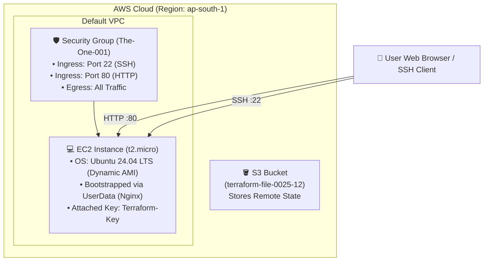

# Project 1: Automated EC2 Web Server with Zero-Touch Bootstrap

[](https://www.terraform.io/)
[](https://registry.terraform.io/providers/hashicorp/aws/latest)
[](https://ubuntu.com/)

A production-grade, modular Terraform project that automatically provisions an AWS EC2 instance in **Mumbai (`ap-south-1`)**, generates secure SSH keys, configures firewall rules, and bootstraps an **Nginx Web Server** with zero manual intervention.

---

## 🏗️ Architecture Overview



---

## ✨ Features

- **Zero-Touch Bootstrapping**: EC2 automatically runs `userdata.sh` on first boot to install Nginx, pull its private IP, and serve a dark-themed status dashboard.
- **Automated Key Pair Management**: Generates a 4096-bit RSA key pair in memory, registers it with AWS, and downloads `Terraform-Key.pem` to your local machine.
- **Dynamic AMI Discovery**: Uses the `aws_ami` data source to automatically fetch the latest official Canonical Ubuntu 24.04 LTS image (no hardcoded AMI IDs).
- **Remote State Storage**: State is backed up in AWS S3 (`dev/terraform.tfstate`) for durability and consistency.
- **Clean Architecture**: Cleanly separated into `provider.tf`, `variables.tf`, `terraform.tfvars`, `security_group.tf`, `ec2.tf`, and `outputs.tf`.

---

## 🚀 Quick Start (Deploy in 2 Commands)

### Prerequisites
1. [Terraform](https://developer.hashicorp.com/terraform/install) (>= 1.5.0) installed.
2. [AWS CLI](https://aws.amazon.com/cli/) installed and configured (`aws configure`).

### 1. Initialize
Clone this repo and initialize Terraform to download providers and connect to the S3 backend:
```bash
terraform init
```

### 2. Deploy
Provision the entire infrastructure in a single command:
```bash
terraform apply -auto-approve
```

Once deployment finishes (~30-45 seconds), Terraform outputs your live endpoints:
```text
Outputs:

server_public_ip = "13.233.xx.xx"
ssh_command = "ssh -i Terraform-Key.pem ubuntu@13.233.xx.xx"
```

---

## 🌐 Accessing the Application

### Open in Browser
Visit your server's Public IP in any web browser:
```text
http://<server_public_ip>
```

### Connect via SSH
To log into the server terminal:
```bash
ssh -i Terraform-Key.pem ubuntu@<server_public_ip>
```

---

## 🧹 Teardown (Clean Up All Resources)

To delete all provisioned AWS resources and avoid any cloud charges:
```bash
terraform destroy -auto-approve
```

---

## 📁 Repository Structure

```text
.
├── provider.tf           # AWS Provider & S3 remote backend configuration
├── variables.tf          # Variable declarations (Region, instance type, name)
├── terraform.tfvars      # Input variable values
├── main.tf               # 4096-bit RSA Key Pair generation & local .pem file
├── security_group.tf     # Firewall rules (Port 22 SSH & Port 80 HTTP)
├── ec2.tf                # EC2 instance definition with dynamic AMI lookup
├── userdata.sh           # Linux bootstrap script (Installs Nginx & HTML page)
├── outputs.tf            # Terminal output declarations (Public IP & SSH command)
├── .gitignore            # Git exclusion rules (Excludes .pem, .tfstate, etc.)
└── README.md             # Project documentation
```
