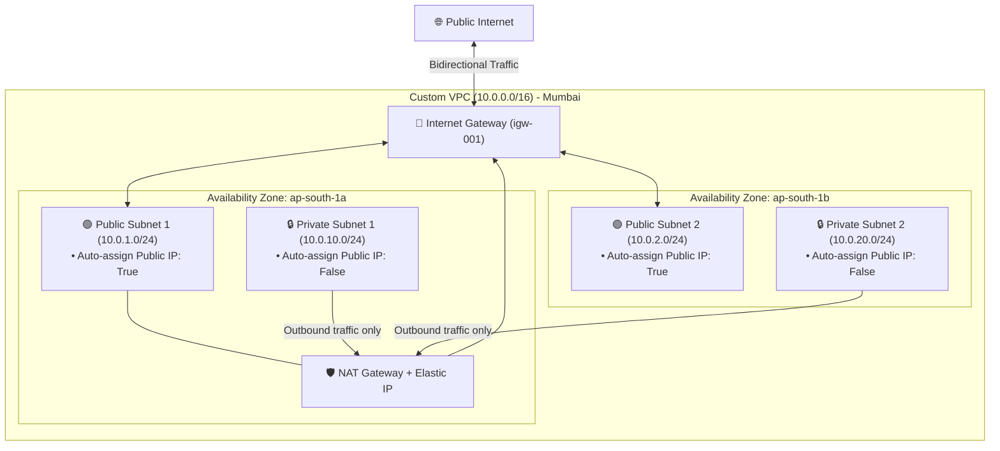

# Project 2: Production Custom Multi-AZ VPC Architecture

[](https://www.terraform.io/)
[](https://registry.terraform.io/providers/hashicorp/aws/latest)
[-232F3E?logo=amazon-aws&logoColor=white)](#)

A production-grade, highly available Amazon Virtual Private Cloud (VPC) designed for high resilience, security, and scalability across multiple Availability Zones in Mumbai (`ap-south-1`).

---

## 🏗️ Architecture Diagram



---

## 📊 Subnet Allocation Plan

| Subnet Name | CIDR Block | Availability Zone | Tier | Purpose |
| :--- | :--- | :--- | :--- | :--- |
| **`public-1a`** | `10.0.1.0/24` | `ap-south-1a` | **Public** | Load Balancers, Web Tier, NAT Gateway |
| **`public-1b`** | `10.0.2.0/24` | `ap-south-1b` | **Public** | High Availability Secondary Public Tier |
| **`private-1a`** | `10.0.10.0/24` | `ap-south-1a` | **Private** | App Tier, Database Primary |
| **`private-1b`** | `10.0.20.0/24` | `ap-south-1b` | **Private** | Database Standby / Read Replica |

---

## 🧪 Verification & Testing (2 Methods)

### Method 1: AWS Route Table Verification (Instant CLI Test)
Inspect AWS's physical routing tables to verify the active routes:

#### 1. Verify Public Subnet Internet Access:
```bash
aws ec2 describe-route-tables --filters "Name=tag:Name,Values=Terraform-001-public-rt" --region ap-south-1 --query "RouteTables[*].Routes" --output table
```
**Expected Output**:
```text
+----------------------+-------------------------+--------------------+---------+
| DestinationCidrBlock |        GatewayId        |      Origin        |  State  |
+----------------------+-------------------------+--------------------+---------+
|  10.0.0.0/16         |  local                  |  CreateRouteTable  |  active |
|  0.0.0.0/0           |  igw-09363ea1e761c89e0  |  CreateRoute       |  active |
+----------------------+-------------------------+--------------------+---------+
```

#### 2. Verify Private Subnet Outbound NAT Access:
```bash
aws ec2 describe-route-tables --filters "Name=tag:Name,Values=Terraform-001-private-rt" --region ap-south-1 --query "RouteTables[*].Routes" --output table
```
**Expected Output**:
```text
+-----------------------+------------+-------------------------+-------------------+---------+
| DestinationCidrBlock  | GatewayId  |      NatGatewayId       |      Origin       |  State  |
+-----------------------+------------+-------------------------+-------------------+---------+
|  10.0.0.0/16          |  local     |                         |  CreateRouteTable |  active |
|  0.0.0.0/0            |            |  nat-00603747cc7d61945  |  CreateRoute      |  active |
+-----------------------+------------+-------------------------+-------------------+---------+
```
*(Both `State` columns showing **`active`** confirms 100% operational routing).*

---

### Method 2: The "Bastion Jump" End-to-End Test (Live Packets)

To test real packets flowing through your subnets:


1. **Test Public Subnet**:
   * Launch an EC2 instance in `public_1`.
   * SSH directly into it using its Public IP.
   * **Result**: Proves Public Subnet + Internet Gateway connectivity.

2. **Test Private Subnet & NAT Gateway**:
   * Launch an EC2 instance in `private_1` (with **no public IP**).
   * From your public instance, SSH into the private instance's private IP (`10.0.10.x`).
   * Inside the private instance, run:
     ```bash
     curl ifconfig.me
     ```
   * **Result**: The output prints the **Elastic IP of your NAT Gateway (`nat_gateway_ip`)**! This proves the private server safely reaches the internet through the NAT Gateway.

---

## 🚀 Quick Start

### 1. Initialize
```bash
terraform init
```

### 2. Deploy
```bash
terraform apply -auto-approve
```

### 3. Cleanup (Save Costs)
```bash
terraform destroy -auto-approve
```

---

## 📁 File Structure

```text
project-2/
├── provider.tf         # S3 remote state key: "project-2/terraform.tfstate"
├── variables.tf        # CIDR blocks, AZs, and project name variables
├── terraform.tfvars    # Input values for variables
├── vpc.tf              # Main custom VPC definition
├── subnets.tf          # 2 Public + 2 Private Multi-AZ subnets
├── gateways.tf         # Internet Gateway, Elastic IP, and NAT Gateway
├── routes.tf           # Public/Private Route Tables & Subnet Associations
├── outputs.tf          # Exported VPC, Subnet, and NAT IP values
└── README.md           # Project documentation and verification guide
```
