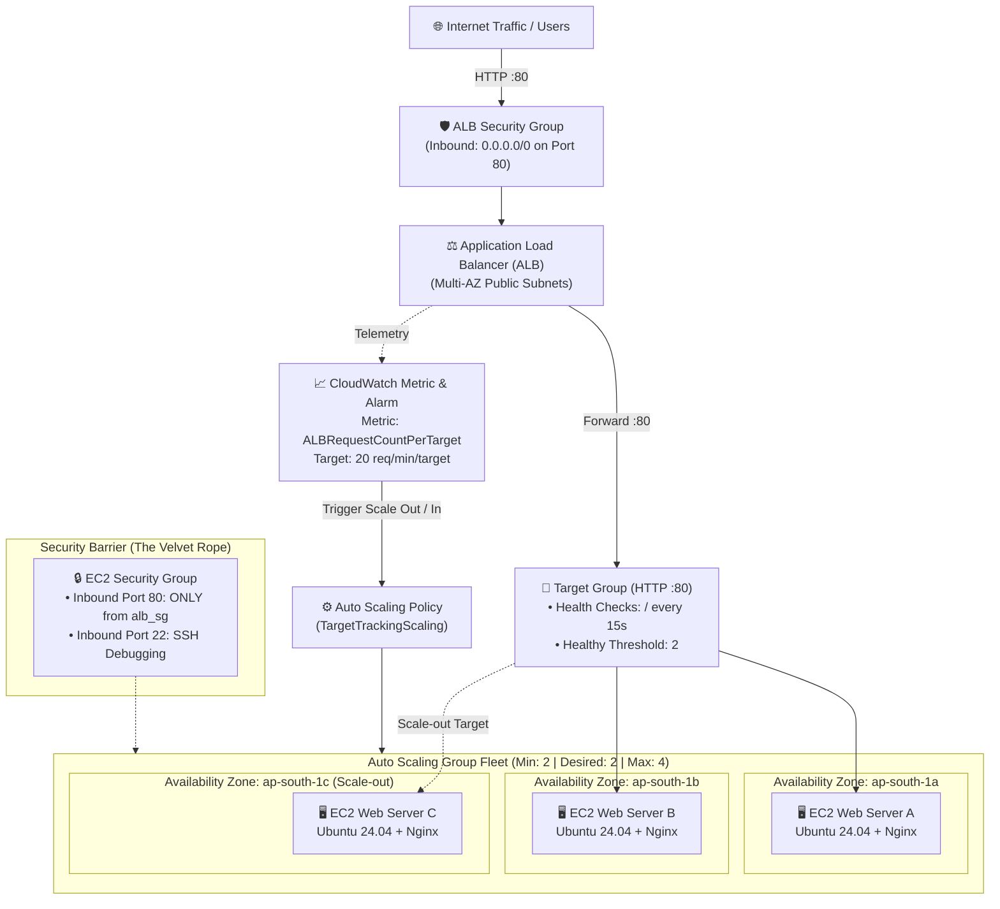

# Project 3: High Availability Application Load Balancer & Auto Scaling Group Architecture

[](https://www.terraform.io/)
[](https://registry.terraform.io/providers/hashicorp/aws/latest)
[-232F3E?logo=amazon-aws&logoColor=white)](#)
[](#)

A production-grade, highly available, and self-healing infrastructure featuring an internet-facing **Application Load Balancer (ALB)**, an **Auto Scaling Group (ASG)** spanning multiple Availability Zones in Mumbai (`ap-south-1`), and a dynamic **Target Tracking Scaling Policy** that automatically scales compute capacity based on live web traffic.

---

## 🏗️ Architecture Diagram



---

## 💎 Key Features & Architecture Highlights

| Component | Resource | Details & Design Decisions |
| :--- | :--- | :--- |
| **Data Discovery** | `data.aws_vpc`, `data.aws_subnets` | Automatically discovers the default Mumbai VPC and subnets across all AZs dynamically. |
| **Security Isolation** | `aws_security_group` | Multi-tier security: ALB accepts public traffic on port 80; EC2 instances **only** accept HTTP from the ALB's security group ("The Velvet Rope"). |
| **Compute Definition** | `aws_launch_template` | Configures `t3.micro` instances with Ubuntu 24.04 AMI (Canonical ID `099720109477`), bootstrapped with Nginx via cloud-init `user_data` rendering real-time Private IP and AZ. |
| **Traffic Distribution**| `aws_lb`, `aws_lb_listener` | Public Layer 7 Application Load Balancer with HTTP:80 listener forwarding to target group. |
| **Health Probes** | `aws_lb_target_group` | Proactive health checks pings `/` every 15s. Replaces unhealthy instances automatically. |
| **Elastic Fleet** | `aws_autoscaling_group` | Maintains minimum of 2 and expands up to 4 instances. Configured with `health_check_type = "ELB"` and 300s grace period. |
| **Auto Scaling Policy** | `aws_autoscaling_policy` | Target tracking scaling with `ALBRequestCountPerTarget` target value of 20 requests/minute/target. |

---

## 🧪 Verification & Testing

### 1. Test Load Balancing Across Availability Zones
Verify that the ALB distributes incoming requests across healthy instances in different Mumbai Availability Zones:

```powershell
$ALB = (terraform output -raw alb_dns_name)
1..8 | ForEach-Object {
    curl.exe -s $ALB | Select-String -Pattern "Private IP", "Availability Zone"
}
```
*Expected Result:* The output cycles through different Private IPs and Mumbai AZs (`ap-south-1a`, `ap-south-1b`, etc.).

---

### 2. Live Traffic Load Test (Trigger Scale-Out)
Run this loop in PowerShell to generate continuous HTTP traffic exceeding the 20 req/min/target threshold:

```powershell
$ALB = (terraform output -raw alb_dns_name)
Write-Host "Sending continuous traffic to $ALB ... (Press Ctrl+C to stop)"

$count = 0
while ($true) {
    curl.exe -s -o NUL $ALB
    $count++
    if ($count % 50 -eq 0) {
        Write-Host "Sent $count requests so far..."
    }
}
```

---

### 3. Monitor Scaling Events in Real-Time
In a second terminal, monitor the fleet capacity and scaling activities:

#### Live Fleet Monitor:
```powershell
while ($true) {
    Clear-Host
    Get-Date
    aws autoscaling describe-auto-scaling-groups `
      --region ap-south-1 `
      --query "AutoScalingGroups[?contains(AutoScalingGroupName, 'terraform-001')].[AutoScalingGroupName, DesiredCapacity, length(Instances)]" `
      --output table
    Start-Sleep -Seconds 10
}
```

#### Inspect Scaling Event Logs:
```powershell
aws autoscaling describe-scaling-activities `
  --region ap-south-1 `
  --query "Activities[0:5].[StartTime, StatusCode, Description]" `
  --output table
```

---

### 4. Test Self-Healing (Fault Tolerance)
Terminate an instance manually to watch the ASG automatically replace it:

```powershell
# Grab an active instance ID
$instanceId = (aws autoscaling describe-auto-scaling-groups `
  --region ap-south-1 `
  --query "AutoScalingGroups[?contains(AutoScalingGroupName, 'terraform-001')].Instances[0].InstanceId" `
  --output text)

# Manually terminate it
aws ec2 terminate-instances --region ap-south-1 --instance-ids $instanceId
```
*Expected Result:* The ASG detects the terminated instance and immediately launches a new replacement to maintain `desired_capacity = 2`.

---

## 🚀 Quick Start

### 1. Initialize
```bash
terraform init
```

### 2. Deploy
```bash
terraform apply -auto-approve
```

### 3. Access the Application
Get the ALB URL from the output:
```bash
terraform output alb_dns_name
```

### 4. Cleanup (Prevent AWS Billing)
```bash
terraform destroy -auto-approve
```

---

## 📁 File Structure

```text
project-3/
├── provider.tf           # S3 remote state backend (key: "project-3/terraform.tfstate")
├── variables.tf          # Configurable variables (region, instance type, ASG dimensions)
├── terraform.tfvars      # Input values for project parameters
├── network_data.tf       # Data sources to discover default Mumbai VPC & multi-AZ subnets
├── security_groups.tf    # ALB public firewall & EC2 restricted security group
├── alb.tf                # Application Load Balancer, Target Group & HTTP Listener
├── asg.tf                # Launch Template, Auto Scaling Group & Target Tracking Policy
├── outputs.tf            # Exported ALB DNS URL
└── README.md             # Project documentation and operational testing guide
```
